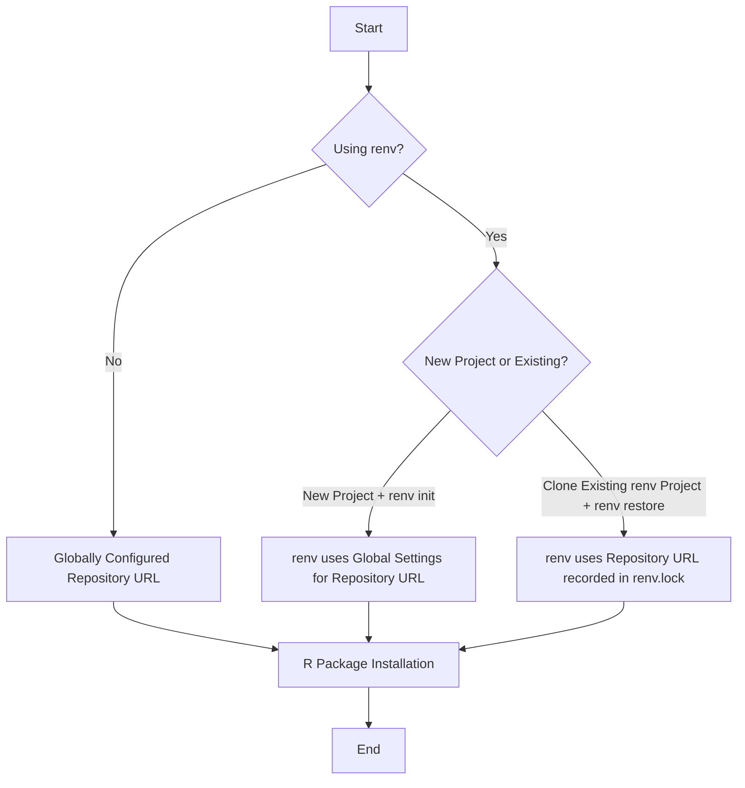

# Bioconductor and renv example 

This is a very simple example showing a repository that can be cloned down to show how repositories can be changed and updated with the renv package. 

## Renv 

[renv](https://rstudio.github.io/renv/articles/renv.html) helps you track and control package changes - making it easy to revert back if you need to. It works with your current methods of installing packages (install.packages()), and was designed to work with most data science workflows.

## Reading 

- Get started with renv in the RStudio IDE: <https://docs.posit.co/ide/user/ide/guide/environments/r/renv.html>
- You should be using renv: <https://www.youtube.com/watch?v=GwVx_pf2uz4>
- Using Public Package Manager : <https://support.rstudio.com/hc/en-us/articles/360046703913-FAQ-for-RStudio-Public-Package-Manager>
- CRAN startup: Friendly R Startup Configuration: <https://cran.r-project.org/web/packages/startup/vignettes/startup-intro.html>
- Some useful Bioconductor commands and tricks: <https://solutions.posit.co/envs-pkgs/bioconductor/index.html#problem-statement> and <https://pkgs.rstudio.com/renv/articles/bioconductor.html>. 

## Understand your package repositories (before renv) 

We can check our package repositories with: `options('repos')`

<details>
<summary>Expand an example output</summary>

```
> options("repos")
$repos
                                                    BioCsoft 
               "https://bioconductor.org/packages/3.20/bioc" 
                                                     BioCann 
    "https://bioconductor.org/packages/3.20/data/annotation" 
                                                     BioCexp 
    "https://bioconductor.org/packages/3.20/data/experiment" 
                                               BioCworkflows 
          "https://bioconductor.org/packages/3.20/workflows" 
                                                   BioCbooks 
              "https://bioconductor.org/packages/3.20/books" 
                                                        CRAN 
"https://pkg.current.posit.team/cran/__linux__/jammy/latest" 
```

</details>

We can set it with: 

```r
repos <- c(CRAN = "https://cloud.r-project.org", WORK = "https://work.example.org")
options(repos = repos)
```

## How is the repository set? 

Simple example: 



More complex example showing how to overwrite the behavior: 

```mermaid
graph TD
    A[Start] --> B{Using renv?}

    B -- No --> C[Globally Configured Repository URL]
    B -- Yes --> D{New Project or Existing?}

    D -- New Project + renv init --> E[renv uses Global Settings for Repository URL]
    D -- Clone Existing renv Project + renv restore --> F{Repository URL Specified During Restore?}

    F -- No --> G[renv uses Repository URL recorded in renv.lock]
    F -- Yes --> H[renv uses Specified Repository URL]

    H --> I[renv snapshot]
    I --> J[New Repository URL recorded in renv.lock]

    G --> K[R Package Installation (CRAN)]
    J --> K
    E --> K
    C --> K

    subgraph Bioconductor Specifics
        L[Start Bioconductor Flow] --> M{Using renv + BiocManager?}
        M -- No --> N[Globally Configured Bioconductor URL (e.g., options("BioC_mirror"))]
        M -- Yes --> O{New Project or Existing?}

        O -- New Project + renv init --> P[renv uses Global Bioconductor Settings]
        O -- Clone Existing renv Project + renv restore --> Q{Bioconductor URL Specified During Restore?}

        Q -- No --> R[renv uses Bioconductor URL recorded in renv.lock]
        Q -- Yes --> S[renv uses Specified Bioconductor URL]

        S --> T[renv snapshot]
        T --> U[New Bioconductor URL recorded in renv.lock]

        R --> V[Bioconductor Package Installation]
        U --> V
        P --> V
        N --> V
    end

    K --> W[End]
    V --> W
```

## Bioconductor

In order to set up Bioconductor we need to: 

Add the following code to your R startup file (~/.Rprofile) or as a Workbench admin add this to the site-wide R startup file (Rprofile.site) to apply the configuration for all users: 

```r
# Configure BiocManager to use Posit Package Manager
options(BioC_mirror = "https://pkg.current.posit.team/bioconductor/latest")

# Configure BiocManager to load its configuration from Package Manager
options(BIOCONDUCTOR_CONFIG_FILE = "https://pkg.current.posit.team/bioconductor/latest/config.yaml")

# Set the Bioconductor version to prevent defaulting to a newer version
Sys.setenv("R_BIOC_VERSION" = "3.22")

# Configure a CRAN snapshot compatible with Bioconductor 3.22
options(repos = c(CRAN = "https://pkg.current.posit.team/cran/__linux__/jammy/latest"))

# Set the biocmanager repo url 
options(repos=c(BiocManager::repositories()))
```

Restart R and verify that the repos have been configured:

```r
BiocManager::repositories()
options('repos')
```

<details>
<summary>Expand an example output</summary>

```
> BiocManager::repositories()
'getOption("repos")' replaces Bioconductor standard repositories, see 'help("repositories", package = "BiocManager")' for
details.
Replacement repositories:
    CRAN: https://pkg.current.posit.team/cran/__linux__/jammy/latest
                                                    BioCsoft                                                      BioCann 
               "https://bioconductor.org/packages/3.20/bioc"     "https://bioconductor.org/packages/3.20/data/annotation" 
                                                     BioCexp                                                BioCworkflows 
    "https://bioconductor.org/packages/3.20/data/experiment"           "https://bioconductor.org/packages/3.20/workflows" 
                                                   BioCbooks                                                         CRAN 
              "https://bioconductor.org/packages/3.20/books" "https://pkg.current.posit.team/cran/__linux__/jammy/latest" 
```

</details>

## Workflow 

### Fast installs with pak 

Parallelize your package installs (particularly useful for monstrous bioconductor packages) using pak with renv. pak will natively use parallelization for the install, making it a ton faster: `options(renv.config.pak.enabled=TRUE)`

### Update your renv version into your lock file before doing a restore

Use `renv::record("renv@1.0.7")` to record renv 1.0.7 in the lockfile.

### renv and bioconductor 

For bioconductor: 

- `options(repos=c(BiocManager::repositories()))`
- `renv::init(bioconductor=TRUE)`

```r
# Set the biocmanager repo url 
options(repos=c(BiocManager::repositories()))

# use the latest-available Bioconductor release
renv::init(bioconductor = TRUE)

# use a specific version of Bioconductor
renv::init(bioconductor = "3.14")
```

Some useful Bioconductor commands and tricks: <https://solutions.posit.co/envs-pkgs/bioconductor/index.html#problem-statement> and <https://pkgs.rstudio.com/renv/articles/bioconductor.html>. 

### Example workflow

The R package upgrade workflow:

```r
# Use pak with renv
options(renv.config.pak.enabled=TRUE)

# Set the biocmanager repo url 
options(repos=c(BiocManager::repositories()))

# initiate the renv project
renv::init(bioconductor=TRUE, repos=options('repos'))

# record the current dependencies in a file called renv.lock
renv::snapshot()

# upgrade your packages 
renv::upgrade()

# if an upgrade goes astray, revert the lockfile
renv::revert(commit = "abc123")

# and restore the previous environment
renv::restore()

# restore the environment when installing on another machine 
renv::restore()
```

### renv::restore() and repository url

The default behavior is to keep the repository URL's in the lockfile when running `renv::restore().` 

For example, we might follow these steps to restore a bioconductor renv project: 

```r
# Use pak with renv
options(renv.config.pak.enabled=TRUE)

# Update the version of renv in the lock file to latest
renv::record("renv@1.0.7")

# Set the biocmanager repo url 
options(repos=c(BiocManager::repositories()))

# restore the renv project
renv::restore(bioconductor=TRUE, repos=options('repos'))
```

#### Changing the repository URL 

If we want to clone down a project and reference a different repository we can: 

```r
# Use pak with renv
options(renv.config.pak.enabled=TRUE)

# Update the version of renv in the lock file to latest
renv::record("renv@1.0.7")

# Set the R repository url(s)
repos <- c(CRAN = "https://cloud.r-project.org", RSPM = "https://pkg.current.posit.team/cran/__linux__/jammy/latest")

# Set the biocmanager repo url 
options(repos=c(BiocManager::repositories()))

# restore the renv project
renv::restore(rebuild=TRUE, bioconductor=TRUE, repos=options('repos'))

# save the new repository URL to the lock file 
renv::snapshot(repos = c("RSPM" = "https://packagemanager.posit.co/cran/__linux__/jammy/latest"))
```

### Useful debugging commands

- Add more detail to logging: `options(renv.download.trace = TRUE)`
- Running a diagnostic: `renv::diagnostics(project = NULL)`
- Checking the library location (check this from inside a renv project): `renv::paths$library()`
- Checking the users install location (check this while OUTSIDE of an renv project): `.libPaths()`
- One more thing to check - is the location the packages are being installed a sharedrive? If so can we check with IT how the drive was mounted? Mounting with `noexec` can create some weird issues. They'd check `/etc/fstab` to see if the home directories are mounted with noexec.


